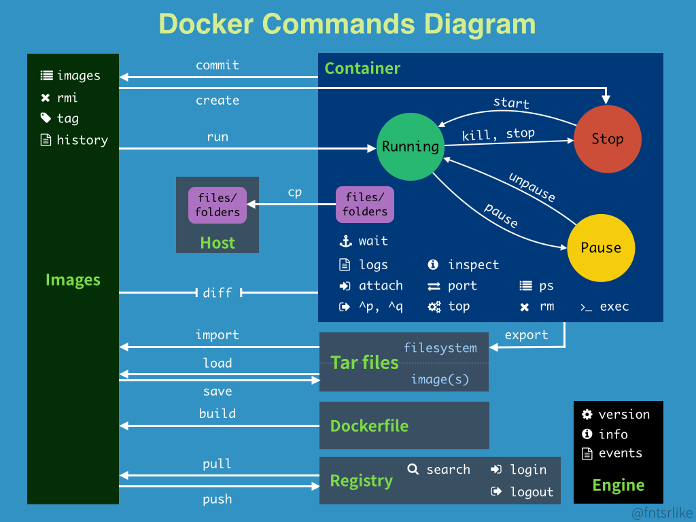

# docker指令示意圖


# 檢查版本
```
$ sudo docker version

Client:
 Version:      1.13.1
 API version:  1.26
 Go version:   go1.6.2
 Git commit:   092cba3
 Built:        Thu Nov  2 20:40:23 2017
 OS/Arch:      linux/amd64

Server:
 Version:      1.13.1
 API version:  1.26 (minimum version 1.12)
 Go version:   go1.6.2
 Git commit:   092cba3
 Built:        Thu Nov  2 20:40:23 2017
 OS/Arch:      linux/amd64
 Experimental: false
```

# Info
```
$sudo docker info

```

# events
```
$sudo docker events
```